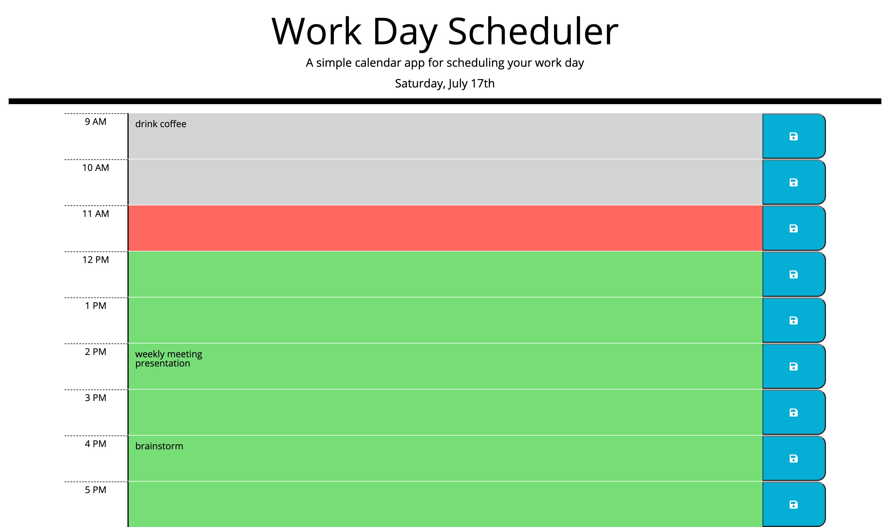

# scheduler

A simple calendar application that allows the user to save events for each hour of the workday
​
## Technologies Used

* HTML
* CSS
* JavaScript powered by jQuery
## Description 

 This app allows user to add important events to a daily planner and helps to manage time effectively. The standard business hours start at 9 a.m. and end at 5 p.m. The current day is displayed at the top of the calendar. Each line of the calendar represents a different business hour and is colored grey, red, or green if the hour is in the past, present, or future respectively.

## Usage 
​
To enter an event click into a time block. To save new event click the save button for that event time block.
## Page View

| 
## Link
Link to deployed application https://irina-golubitsky.github.io/code-quiz/

---
MIT License
Copyright (c) [2021] [Irina Golubitsky]